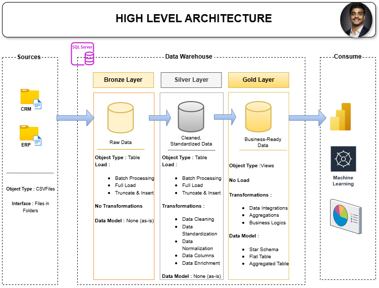

# Sales Data Warehouse & Analytics Project using SQL Server

This project demonstrates the design and implementation of a SQL-based data warehouse for sales analytics. 

The objective of this project is to transform raw ERP and CRM datasets into a structured analytical data model using SQL Server. The final data model enables efficient querying and business analysis using a star schema design.

This project was developed as part of my data analytics learning journey and focuses on data modeling, ETL processes, and analytical SQL queries.

---

## 🏗️ Data Architecture

The data warehouse follows a layered architecture inspired by the Medallion model:

• Bronze Layer – Raw data ingestion from ERP and CRM CSV files  
• Silver Layer – Data cleaning, transformation, and normalization  
• Gold Layer – Analytical star schema used for business reporting



---

## 📖 Project Overview

This project involves:

1. **Data Architecture**: Designing a Modern Data Warehouse Using Medallion Architecture **Bronze**, **Silver**, and **Gold** layers.
2. **ETL Pipelines**: Extracting, transforming, and loading data from source systems into the warehouse.
3. **Data Modeling**: Developing fact and dimension tables optimized for analytical queries.
4. **Analytics & Reporting**: Creating SQL-based reports and dashboards for actionable insights.

---

## 🚀 Project Requirements

### Building the Data Warehouse (Data Engineering)

#### Objective
Develop a modern data warehouse using SQL Server to consolidate sales data, enabling analytical reporting and informed decision-making.

#### Specifications
- **Data Sources**: Import data from two source systems (ERP and CRM) provided as CSV files.
- **Data Quality**: Cleanse and resolve data quality issues prior to analysis.
- **Integration**: Combine both sources into a single, user-friendly data model designed for analytical queries.
- **Scope**: Focus on the latest dataset only; historization of data is not required.
- **Documentation**: Provide clear documentation of the data model to support both business stakeholders and analytics teams.

---

## 📂 Repository Structure
```
data-warehouse-project/
│
├── datasets/                           # Raw datasets used for the project (ERP and CRM data)
│
├── docs/                               # Project documentation and architecture details
│   ├── etl.drawio                      # Draw.io file shows all different techniquies and methods of ETL
│   ├── data_architecture.drawio        # Draw.io file shows the project's architecture
│   ├── data_catalog.md                 # Catalog of datasets, including field descriptions and metadata
│   ├── data_flow.drawio                # Draw.io file for the data flow diagram
│   ├── data_models.drawio              # Draw.io file for data models (star schema)
│   ├── naming-conventions.md           # Consistent naming guidelines for tables, columns, and files
│
├── scripts/                            # SQL scripts for ETL and transformations
│   ├── bronze/                         # Scripts for extracting and loading raw data
│   ├── silver/                         # Scripts for cleaning and transforming data
│   ├── gold/                           # Scripts for creating analytical models
│
├── tests/                              # Test scripts and quality files
│
├── README.md                           # Project overview and instructions
├── LICENSE                             # License information for the repository
├── .gitignore                          # Files and directories to be ignored by Git
└── requirements.txt                    # Dependencies and requirements for the project
```
---

## 🛠️ Tools & Technologies

• SQL Server  
• SQL (T-SQL)  
• Git & GitHub  
• Draw.io (for architecture diagrams)  
• CSV datasets

---

## 🎯 Key Learnings

Through this project I learned:

• Designing a layered data warehouse architecture  
• Implementing ETL pipelines using SQL  
• Building fact and dimension tables  
• Writing analytical SQL queries for business insights  
• Structuring a data project repository using GitHub

---

## 👤 Author

Kiran Kalisetti  
Data Analyst | SQL | Python | Power BI | Excel

